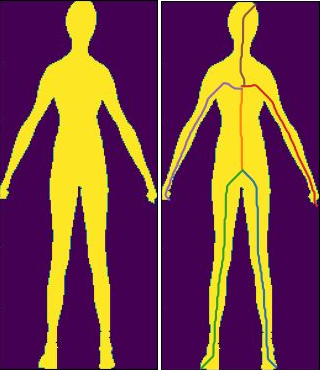

# skeletonize

The skeletonize class finds the skeleton of a 2D pixel-based or 3D voxel-based object. The method detects ridges in the distance field of the object surface. If you use skeletonize in your research, please cite:

- Abdollahzadeh, A., Sierra, A. & Tohka, J. Cylindrical Shape Decomposition for 3D Segmentation of Tubular Objects. IEEE Access 9, 23979–23995 (2021).

The implementation only requires numpy and scikit-fmm:

```python
import numpy as np
from skeletonize import skeletonize

fn = './examples/bw_2d.npy'
bw_2d = np.load(fn)

skel = skeletonize(speed_power=1.2, Euler_step_size=0.5, depth_th=2, length_th=None, simple_path=False, verbose=False)
s = skel.skeleton(bw_2d)

```
- speed_power defines the power of the speed image.
- Euler_step_size: The Euler scheme is used for the back-tracking procedure, which solves the ordinary differential equation with a sub-voxel accuracy. 
- depth_th: prunning skeleton branches as a factor of deepest point in the object
- length_th: prunning skeleton branches as a factor of longest skeleton branch
- simple_path: substitute Euler method to define the shortest path
- verbose: print the branch length while finding the skeleton


